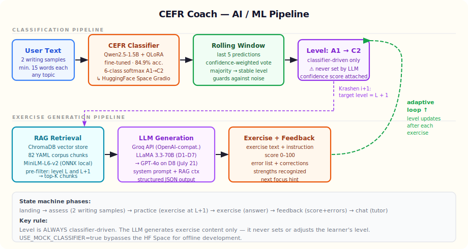
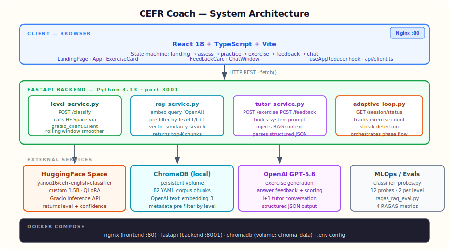

# CEFR Coach

> Adaptive English tutor powered by a fine-tuned CEFR classifier and Krashen's **i+1** method.
> Write two short samples → the AI pins your level → exercises target exactly one step ahead.


**Live demo:** [cefr-coach.vercel.app](https://cefr-coach.vercel.app) · **API:** [cefr-coach-api.onrender.com](https://cefr-coach-api.onrender.com)

---

## What is CEFR Coach?

CEFR Coach is an end-to-end adaptive English learning app built for **Build Week 2026**.

Instead of a generic placement quiz, it watches **how you write** — grammar patterns, vocabulary range, clause complexity — and runs your text through a **custom fine-tuned classifier** that outputs one of six CEFR levels (A1 → C2). Every exercise is then generated at exactly **L+1** (one level above yours), following Krashen's *Input Hypothesis*: comprehensible challenge, not frustration.

The feedback loop is continuous:
1. **You write** → classifier reads your grammar
2. **Level is pinned** → RAG retrieves i+1 corpus chunks
3. **GPT-5.6 generates** a targeted exercise
4. **You answer** → GPT-5.6 scores and explains errors
5. **Level re-evaluates** → loop repeats at your current edge

---

## How GPT-5.6 & Codex were used

**GPT-5.6** is the reasoning engine behind every piece of generated content:
- **Exercise generation** — given the learner's level and a RAG-retrieved grammar context, GPT-5.6 writes a targeted, level-appropriate exercise (`tutor_service.generate_exercise`).
- **Feedback & scoring** — GPT-5.6 evaluates the learner's answer, returns a structured JSON with a 0–100 score, a strengths list, and error corrections with explanations (`tutor_service.give_feedback`).
- **Conversational tutor** — GPT-5.6 holds an i+1-calibrated conversation, keeping its language just above the learner's level (`tutor_service.conversation_turn`).

> The classifier — **not** the LLM — always decides the learner's level. GPT-5.6 only generates content; it never overrides the measured level.

**Codex** was used throughout development to build and iterate on the codebase: scaffolding the FastAPI services, the React state machine, the RAG pipeline, the eval harness, and the deployment configuration.

---

## AI / ML Pipeline



### How the classifier works

The heart of the system is **`yanou16/cefr-english-classifier`** — a compact **1.5B-parameter transformer** fine-tuned with **QLoRA** on a balanced CEFR corpus.

| Component | Detail |
|---|---|
| Approach | Parameter-efficient fine-tuning (QLoRA, 4-bit, r=16) |
| Task | 6-class sequence classification (A1/A2/B1/B2/C1/C2) |
| Accuracy | **84.9%** on held-out test set |
| Serving | HuggingFace Space · `gradio_client.Client` |
| Fallback | `USE_MOCK_CLASSIFIER=true` for offline dev |

### Why a rolling window?

A single classification call on 30 words is noisy. `LearnerLevelTracker` keeps a **deque of the last 5 predictions**, each weighted by its confidence score, and takes a confidence-weighted majority vote. This prevents a single outlier response from jumping the learner up or down a level.

> **Critical rule:** the LLM never sets the level. Only the fine-tuned classifier does. The LLM generates content only.

### RAG retrieval

Before calling the LLM, the backend retrieves relevant pedagogical context:

1. The query is embedded via **`text-embedding-3-small`** (OpenAI)
2. **ChromaDB** pre-filters the 82-chunk corpus to only `level == L` and `level == L+1` documents
3. Cosine similarity selects the top-K chunks
4. Chunks are injected into the GPT-5.6 system prompt

This keeps exercises grounded in real CEFR-aligned grammar explanations rather than generic LLM output.

---

## System Architecture



### Backend services (`backend/app/services/`)

| Service | Route(s) | Responsibility |
|---|---|---|
| `level_service.py` | `POST /classify` | Calls HF Space, runs rolling window smoother |
| `rag_service.py` | internal | Embeds query, queries ChromaDB, returns chunks |
| `tutor_service.py` | `POST /exercise` `POST /feedback` `POST /chat` | Builds prompt + RAG context, calls GPT-5.6, parses JSON |
| `adaptive_loop.py` | `GET /session/{id}` | Tracks phase, streak, exercise count |

### Frontend state machine (`frontend/src/hooks/useAppReducer.ts`)

```
landing → assess → practice → exercise → feedback → chat
                   └─────────────────────────────────┘
                         repeats after each exercise
```

The reducer owns all app state: `phase`, `level`, `sessionId`, `streak`, `exercises[]`. API calls are fired in `App.tsx` on phase transitions.

### LLM configuration

The backend uses the OpenAI client. Model and key are read from environment variables, so the provider is swappable without code changes:

```bash
LLM_MODEL=gpt-5.6
LLM_API_KEY=<your-openai-key>
# LLM_BASE_URL left empty → OpenAI default endpoint
```

---

## Tech Stack

| Layer | Technology | Why chosen |
|---|---|---|
| **Classifier** | Fine-tuned 1.5B transformer + QLoRA | Compact enough to fine-tune on a single consumer GPU; strong grasp of grammar patterns |
| **Classifier serving** | HuggingFace Space (Gradio) | Free hosting; `gradio_client` gives a clean Python API; no inference server to manage |
| **Level stability** | Rolling window (deque, n=5) | One noisy prediction shouldn't shift the UX; weighted vote handles varying confidence |
| **Embeddings** | OpenAI `text-embedding-3-small` | High-quality semantic similarity, no local model to load, tiny cost per query |
| **Vector store** | ChromaDB | Zero-ops local store; metadata pre-filtering by level makes retrieval precision much higher |
| **Pedagogy** | Krashen i+1 | Target one level above → comprehensible challenge without demotivating frustration |
| **LLM** | OpenAI GPT-5.6 | Reliable structured JSON output, strong instruction-following for level-calibrated content |
| **Backend** | FastAPI (Python 3.13) | Async, fast, clean Pydantic models; easy to add routes |
| **Frontend** | React 18 + TypeScript + Vite | Type-safe, fast dev loop; `useReducer` maps cleanly to the phase state machine |
| **Deploy** | Vercel (frontend) + Render (backend) | Free tiers, auto-deploy from GitHub, zero infra to manage |

---

## MLOps & Evals

### Classifier probes (`backend/evals/classifier_probes.py`)

12 fixed reference texts — 2 per CEFR level — run against the live `/classify` endpoint:

```bash
python backend/evals/classifier_probes.py --api http://localhost:8001
# Exit 0 = all probes pass, Exit 1 = failures printed
```

Scoring: exact match, with C1/C2 both accepted as "Advanced+" for borderline cases.

### RAG quality (`evals/ragas_rag_eval.py`)

Four [Ragas](https://docs.ragas.io/) metrics evaluated on a 10-question test set:

| Metric | What it measures |
|---|---|
| `faithfulness` | Is the answer grounded in the retrieved context? |
| `answer_relevancy` | Does the answer actually address the question? |
| `context_precision` | Are the retrieved chunks relevant to the question? |
| `context_recall` | Does the context cover what's needed to answer? |

```bash
python evals/ragas_rag_eval.py
# Results written to evals/ragas_results.json
```

---

## Quick Start (local dev)

### Prerequisites

- Python 3.11+
- Node 18+
- An OpenAI API key ([platform.openai.com](https://platform.openai.com))

### 1 — Clone and configure

```bash
git clone https://github.com/yanou16/cefr-coach.git
cd cefr-coach
cp .env.example .env   # then fill in your keys
```

`.env` required variables:

```bash
LLM_MODEL=gpt-5.6
LLM_API_KEY=<your-openai-key>

# Optional — set true to skip HF Space calls during development
USE_MOCK_CLASSIFIER=false
```

### 2 — Backend

```bash
cd backend
python -m venv .venv
.venv\Scripts\activate          # Windows
# source .venv/bin/activate     # Mac/Linux
pip install -r requirements.txt
uvicorn app.main:app --port 8001 --reload
```

### 3 — Frontend

```bash
cd frontend
npm install
npm run dev
# → http://localhost:5173
```

### 4 — Docker (full stack)

```bash
docker compose up --build
# Frontend: http://localhost
# Backend:  http://localhost:8001/docs
```

---

## Project Structure

```
cefr-coach/
├── backend/
│   ├── app/
│   │   ├── main.py                  # FastAPI app, CORS, routes, keep-alive
│   │   └── services/
│   │       ├── level_service.py     # Classifier + rolling window
│   │       ├── rag_service.py       # ChromaDB + OpenAI embeddings
│   │       ├── tutor_service.py     # GPT-5.6 exercise + feedback + chat
│   │       └── adaptive_loop.py     # Session state tracking
│   ├── corpus/                      # YAML exercise corpus (82 chunks)
│   ├── evals/
│   │   └── classifier_probes.py     # 12 fixed-text probes
│   ├── Dockerfile
│   ├── startup.sh
│   └── requirements.txt
├── frontend/
│   ├── src/
│   │   ├── App.tsx                  # Phase routing + API calls
│   │   ├── hooks/useAppReducer.ts   # State machine
│   │   ├── api/client.ts            # fetch wrappers
│   │   ├── components/
│   │   │   ├── LandingPage.tsx      # Landing + live mini-demo
│   │   │   ├── ExerciseCard.tsx     # Exercise display + answer
│   │   │   ├── FeedbackCard.tsx     # Score ring + error list
│   │   │   └── ChatWindow.tsx       # Tutor chat
│   │   └── index.css                # Design tokens + all styles
│   └── package.json
├── evals/
│   └── ragas_rag_eval.py            # RAG quality (4 Ragas metrics)
├── docs/
│   ├── ai-pipeline.svg              # ML pipeline diagram
│   └── architecture.svg             # System architecture diagram
├── docker-compose.yml
├── render.yaml                      # Render backend deploy config
└── .gitignore
```

---

## Deploy

### Frontend → Vercel

1. Import the repo at [vercel.com/new](https://vercel.com/new)
2. Set **Root Directory** to `frontend`
3. Add env var `VITE_API_URL=https://cefr-coach-api.onrender.com`
4. Deploy

### Backend → Render

1. New **Web Service** at [render.com](https://render.com) → connect the repo
2. Runtime **Docker**, root directory `backend`
3. Set env vars `LLM_MODEL=gpt-5.6`, `LLM_API_KEY`, `USE_MOCK_CLASSIFIER=false`
4. Deploy (free tier)

---

## License

MIT — see [LICENSE](LICENSE).

---

*Built during **Build Week 2026** · Custom QLoRA CEFR classifier · Krashen i+1 · ChromaDB RAG · OpenAI GPT-5.6*
